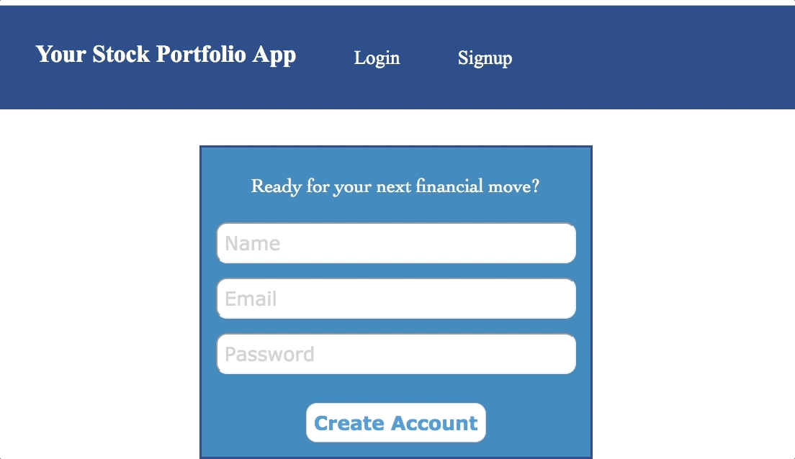

# Stock-Portfolio-App
A Single-Page-Application that allows the user to sign in and buy stocks using an initial cash amount of $5000.

The user can view stock portfolio and stock performance based on color, and past transactions history.

Backend built with Postgres and Express.

Frontend built with React, Firebase Authentication, and Intrinio API (because IEX API no longer free).

## Snapshots Of App
### Log in!

### Let's buy some stocks from Apple and Microsoft!

### Let's buy more stocks from Microsoft!

### Oops, typo and too poor for Apple stocks

